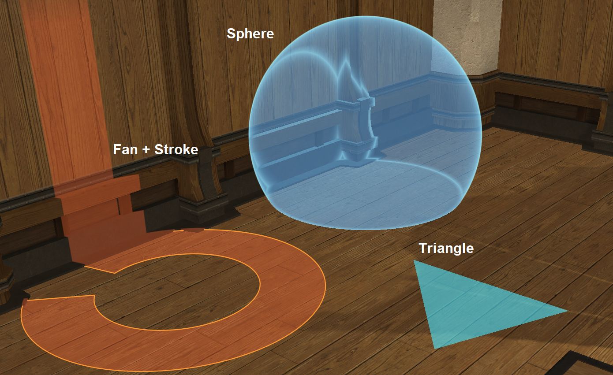
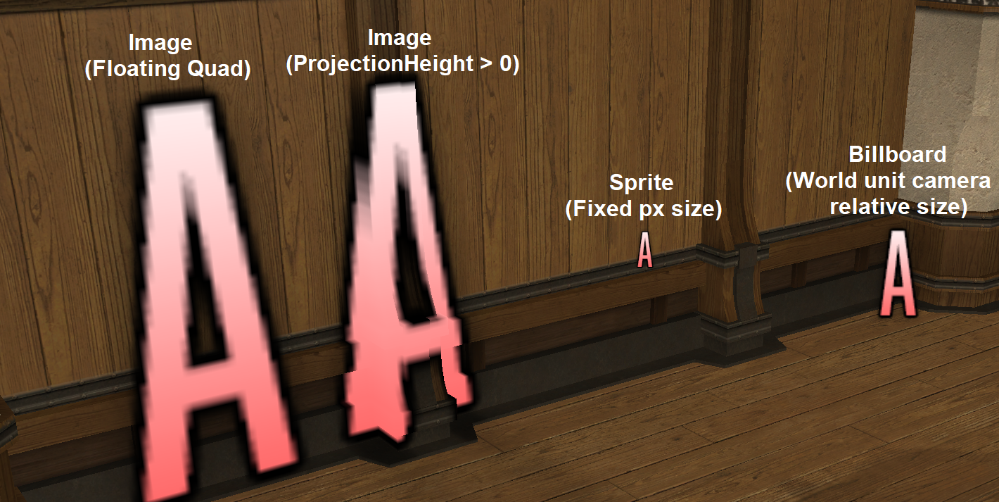
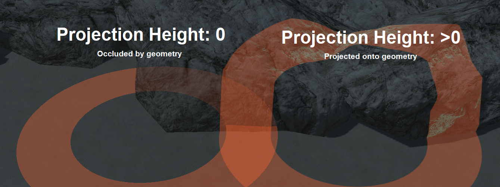

# FFXIV Pictomancy
Pictomancy is a library for drawing 3D world overlays and VFX in Dalamud plugins.
Pictomancy has an ImGui-like interface that operates in world space instead of a 2D canvas.
Pictomancy simplifies the hard parts of 3D overlays by correctly clipping objects behind the camera and clipping around the native UI.

## Demonstration
https://github.com/user-attachments/assets/a7963703-df6a-44fa-9659-f768d0abdced

## Installation
Nuget package: https://www.nuget.org/packages/Pictomancy


Use as a git sub-module:
```bash
git submodule add https://github.com/sourpuh/ffxiv_pictomancy
```

## Use
See the included PictomancyDemo plugin for real example usage.

Library initialization:
```c#
PctContext pctCtx;

public MyPlugin(DalamudPluginInterface pluginInterface)
{
    pctCtx = PctService.Initialize(pluginInterface);

    ... Your Code Here ...
}

public void Dispose()
{
    pctCtx.Dispose();

    ... Your Code Here ...
}
```

`Initialize()` accepts an optional `PctOptions` object which can disable specific renderers or adjust DX buffer sizes.

### Primitives
Pictomancy overlay drawing supports six primitive types: Strokes, Fans, Triangles, Spheres, Images, and Sprites.
* Strokes are connected line segments with a pixel thickness.
    * `AddCircle` uses the Stroke primitive to draw a circle outline.
    * `PathLineTo`, `PathArcTo`, and `PathStroke` can be used to draw arbitrary lines.
* Fans are filled round shapes such as circles, donuts, and cones.
    * `AddCircleFilled` draws using the Fan primitive to draw a filled circle.
* Triangles are used for filled quads, segmented fan fill, or user defined complex shapes such as cubes or meshes.
    * `AddQuadFilled` uses two Triangle primitives to draw a filled quadrilateral.
* Spheres render with fresnel rim and project the color and fresnel effect onto the world.
    * `AddSphere` uses the Sphere primitive.
* Images are textured quads that can be projected onto the world or screen space.
    * `AddImage` draws textured quads using the Image primitive.
* Sprites are similar to images but always face the camera and can be used for billboards or icons.
    * `AddSprite` uses the Sprite primitive and draws with a fixed pixel size.
    * `AddBillboard` uses the Sprite primitive and draws with a camera relative world unit size.

Fans, Triangles, and Images may be projected onto the world.




Pictomancy also supports drawing text and dots at world positions.
These currently do not use the pictomancy renderer; they fall back to ImGui drawing functions.
As such they have a few limitations:
* No UI masking
* No Occlusion / Depth testing
* Not drawn if AutoDraw is disabled

### Drawing an ImGui overlay with DirectX Renderer
```c#
using (var drawList = PctService.Draw())
{
    if (drawList == null)
        return;
    // Draw a circle around a GameObject's hitbox
    Vector3 worldPosition = gameObject.Position;
    float radius = gameObject.HitboxRadius;
    drawList.AddCircleFilled(worldPosition, radius, fillColor);
    drawList.AddCircle(worldPosition, radius, outlineColor);
}
```

### Draw Hints
#### PctDxParams


`PctDxParams` controls how each shape interacts with scene depth and camera distance.
Set a default for the whole drawlist via `PctDrawHints.DefaultParams`, or pass an override per draw call.

```c#
using (var drawList = PctService.Draw(new PctDrawHints
{
    DefaultParams = new PctDxParams
    {
        OccludedAlpha = 0.3f,
        OcclusionTolerance = 0.5f,
        FadeStart = 30f,
        FadeStop = 60f,
    }
}))

// Applies drawlist default params:
drawList.AddCircleFilled(origin, radius, fillColor);

// Applies override params:
// Project the circle +/- 10 meters vertically
drawList.AddCircleFilled(origin, radius, fillColor,
    p: new PctDxParams { ProjectionHeight = 10f });
```

##### OccludedAlpha (0 to 1, default 1)
Alpha multiplier for pixels that are behind scene geometry.
- `0`: invisible behind walls
- `0.5`: ghost through walls
- `1`: fully visible through walls

##### OcclusionTolerance (world meters, default 0)
A pixel is treated as "in front" if it's at most this many meters behind the scene. Useful for ignoring z-fighting on uneven terrain.
- `0`: strict occlusion; even tiny floor unevenness can occlude a ground-level shape
- `0.5`: ignore occlusion up to half a meter
- `Infinity`: ignore occlusion entirely

##### FadeStart / FadeStop (world meters, default Infinity)
Linear fade based on the pixel's distance from the camera.
- Pixels closer than `FadeStart` draw at full alpha.
- Pixels at or beyond `FadeStop` are invisible.
- Linear fade between. Default `Infinity` disables distance fade.

##### ProjectionHeight (0 to Infinity, default 0)
The height in world meters at which to project the primitive. Projections are drawn with a fresnel effect + a fade at the top and bottom 20% height.
- Only Fan and Triangle primitives can be projected, not Strokes.
- If projection height is 0, the fans are drawn flat on the XZ plane, triangles on whatever plane is specified.
- If projection height is greater than 0, fans and triangles are projected up and down by the specified height.
- There is no way for projections to be occluded; projectionHeight is mutually exclusive with occlusion parameters.


#### AutoDraw & UI Masking
UI masking is used to hide the pictomancy overlay behind the native UI.
* `BackbufferAlpha` is the best* UI mask but it does not work with 3D resolution scaling.
    * `BackbufferAlpha` will fallback to `BackbufferSubtraction` when it detects 3D resolution scaling, so it's a safe default option.
    * *Some locations in the game have noise in the BackBuffer alpha, such as O8 (Kefka) which is why it's not default.
* `BackbufferSubtraction` (Default) that works with 3D resolution scaling. It does not handle partially transparent UI very well.
* AutoDraw supports a NativeOverlay option which draws behind the native UI but has two issues:
    1. It does not display over Nameplates.
    1. It lags behind by one frame which causes ghosting effects when moving.


### Drawing with in-game VFX
You must specify an ID for each element you draw. IDs should be consistent across frames and unique for each VFX with the same path.

VFX with the same ID and path are retained when drawn in consecutive frames.  If the ID is specified in consecutive frames, the VFX is updated to match the new parameters. If the ID is not specified in consecutive frames, the VFX is destroyed.
```c#
// Draw a circle omen VFX on a GameObject's hitbox
PctService.VfxRenderer.AddOmen($"{gameobject.EntityId}", "general01bf", gameObject.Position, gameObject.HitboxRadius);

// Draw a tankbuster lockon VFX on a GameObject
PctService.VfxRenderer.AddLockon($"{gameobject.EntityId}", "tank_lockon01i", gameobject);

// Draw a tether channeling VFX between two GameObjects
PctService.VfxRenderer.AddChanneling($"{gameobject.EntityId}", "chn_nomal01f", gameobject1, gameobject2);
```

If you want to draw basic Omen shapes, there are helpers provided to draw circles, lines, cones, and donuts. If the method returns void, it will always successfully draw. If the method returns a boolean, it will return false if it did not find an Omen to match your desired shape.
```c#
// Draw a circle around a GameObject's hitbox using the AddCircle helper
PctService.VfxRenderer.AddCircle($"{gameobject.EntityId}", gameObject.Position, gameObject.HitboxRadius);
```
