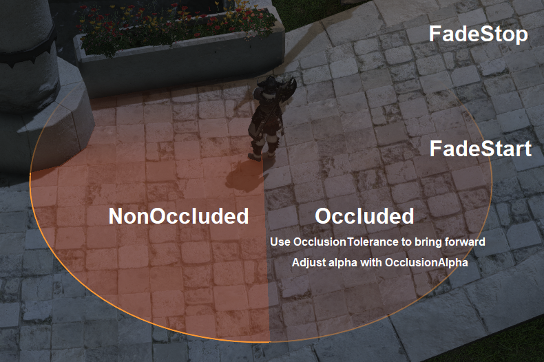

# FFXIV Pictomancy
Pictomancy is a library for drawing 3D world overlays and VFX in Dalamud plugins.
Pictomancy has an ImGui-like interface that operates in world space instead of a 2D canvas.
Pictomancy simplifies the hard parts of 3D overlays by correctly clipping objects behind the camera and clipping around the native UI.

# Pictomancy is still in development and does not have a stable API. Use at your own risk.

## Installation
Nuget package: https://www.nuget.org/packages/Pictomancy


Use as a git sub-module:
```bash
git submodule add https://github.com/sourpuh/ffxiv_pictomancy
```

## Use
See the included PictomancyDemo plugin for real example usage.

Library initialization:
```c#
PctContext pctCtx;

public MyPlugin(DalamudPluginInterface pluginInterface)
{
    pctCtx = PctService.Initialize(pluginInterface);

    ... Your Code Here ...
}

public void Dispose()
{
    pctCtx.Dispose();

    ... Your Code Here ...
}
```

`Initialize()` accepts an optional `PctOptions` object which can disable specific renderers or adjust DX buffer sizes.

### Drawing an ImGui overlay with DirectX Renderer
```c#
using (var drawList = PctService.Draw())
{
    if (drawList == null)
        return;
    // Draw a circle around a GameObject's hitbox
    Vector3 worldPosition = gameObject.Position;
    float radius = gameObject.HitboxRadius;
    drawList.AddCircleFilled(worldPosition, radius, fillColor);
    drawList.AddCircle(worldPosition, radius, outlineColor);
}
```

### Draw Hints
#### PctDxParams


`PctDxParams` controls how each shape interacts with scene depth and camera distance.
Set a default for the whole drawlist via `PctDrawHints.DefaultParams`, or pass an override per draw call.

```c#
using (var drawList = PctService.Draw(new PctDrawHints
{
    DefaultParams = new PctDxParams
    {
        OccludedAlpha = 0.3f,
        OcclusionTolerance = 0.5f,
        FadeStart = 30f,
        FadeStop = 60f,
    }
}))

// Applies drawlist default params:
drawList.AddCircleFilled(origin, radius, fillColor);

// Applies override params:
drawList.AddCircle(origin, radius, outlineColor,
    p: new PctDxParams { OccludedAlpha = 0f }); // strict occlusion for this shape only
```

##### OccludedAlpha (0–1, default 1)
Alpha multiplier for pixels that are behind scene geometry.
- `0`: invisible behind walls
- `0.5`: ghost through walls
- `1`: fully visible through walls

##### OcclusionTolerance (world meters, default 0)
A pixel is treated as "in front" if it's at most this many meters behind the scene. Useful for ignoring z-fighting on uneven terrain.
- `0`: strict occlusion; even tiny floor unevenness can occlude a ground-level shape
- `0.5`: ignore occlusion up to half a meter
- `Infinity`: ignore occlusion entirely

##### FadeStart / FadeStop (world meters, default Infinity)
Linear fade based on the pixel's distance from the camera.
- Pixels closer than `FadeStart` draw at full alpha.
- Pixels at or beyond `FadeStop` are invisible.
- Linear fade between. Default `Infinity` disables distance fade.

#### AutoDraw & UI Masking
UI masking is used to hide the pictomancy overlay behind the native UI.
* Only BackbufferAlpha masking exists currently which does not work with 3D resolution scaling and is automatically disabled.
* AutoDraw supports a NativeOverlay option which draws behind the native UI but has two issues:
    1. It does not display over Nameplates.
    1. It lags behind by one frame which causes ghosting effects when moving.


### Drawing with in-game VFX
You must specify an ID for each element you draw. IDs should be consistent across frames and unique for each VFX with the same path.

VFX with the same ID and path are retained when drawn in consecutive frames.  If the ID is specified in consecutive frames, the VFX is updated to match the new parameters. If the ID is not specified in consecutive frames, the VFX is destroyed.
```c#
// Draw a circle omen VFX on a GameObject's hitbox
PctService.VfxRenderer.AddOmen($"{gameobject.EntityId}", "general01bf", gameObject.Position, gameObject.HitboxRadius);

// Draw a tankbuster lockon VFX on a GameObject
PctService.VfxRenderer.AddLockon($"{gameobject.EntityId}", "tank_lockon01i", gameobject);

// Draw a tether channeling VFX between two GameObjects
PctService.VfxRenderer.AddChanneling($"{gameobject.EntityId}", "chn_nomal01f", gameobject1, gameobject2);
```

If you want to draw basic Omen shapes, there are helpers provided to draw circles, lines, cones, and donuts. If the method returns void, it will always successfully draw. If the method returns a boolean, it will return false if it did not find an Omen to match your desired shape.
```c#
// Draw a circle around a GameObject's hitbox using the AddCircle helper
PctService.VfxRenderer.AddCircle($"{gameobject.EntityId}", gameObject.Position, gameObject.HitboxRadius);
```